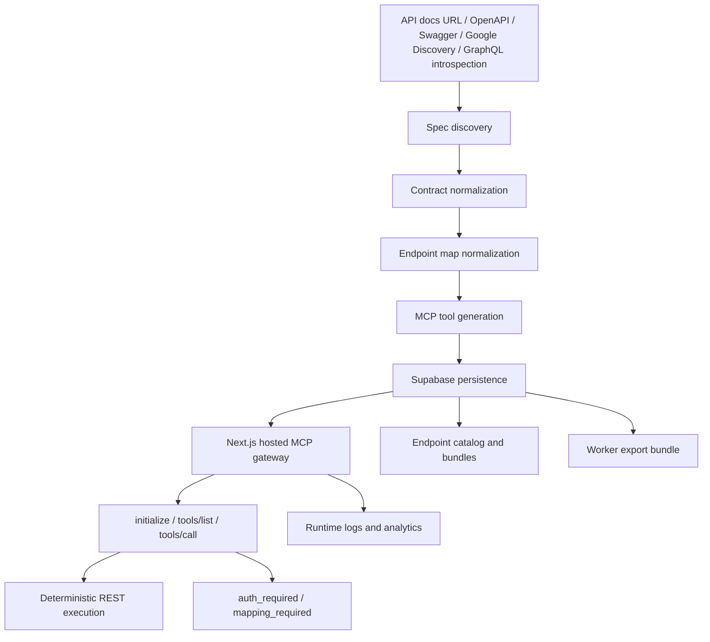

# Astrail

Astrail is the hosted action layer for AI agents. It is MCP-first, not MCP-only.

One-liner: Turn APIs and repeated workflows into safe hosted agent actions.

Astrail helps companies turn API docs, OpenAPI specs, Google Discovery documents, GraphQL introspection JSON, and repeated business workflows into hosted tools AI agents can call. API-contract-to-MCP is the wedge. The hosted runtime is the product.

Teams start with an OpenAPI spec, Swagger/OpenAPI URL, Google Discovery URL, GraphQL introspection JSON, Swagger UI page, Redoc page, API docs URL, or a workflow that needs mapping. For documented APIs, Astrail discovers or fetches the real API contract, validates and normalizes it, generates tool metadata and a TypeScript MCP server export, saves the generation, and exposes a hosted runtime endpoint that agents can connect to.

Current wedge: API/docs -> hosted agent tool in minutes.

Pilot direction: FDE-led workflow mapping -> approved tools -> auth boundaries/RBAC -> SDK customization.

The buyer pain is business-level: every new customer API or internal workflow can become custom integration work. Astrail standardizes that work into endpoint maps, tool schemas, hosted execution, testing, logs, and reusable actions.

MCP code generation is one output. The hosted gateway runtime is the product.

Technical proof: generated code is exportable. Hosted execution uses deterministic endpoint maps — no eval.

## MCP-first, not MCP-only

MCP is the interface agents use today. Astrail's core is the runtime behind it. We normalize APIs into endpoint maps, generate tool schemas, host the endpoint, and execute calls safely. Today that endpoint speaks MCP. The same runtime can support other agent tool formats as the ecosystem evolves.

Technical proof:

- Generated code is exportable.
- Hosted execution uses deterministic endpoint maps.
- No eval.
- `tools/call` maps to real API requests through native `fetch`.

## Core Product Flow

```text
API docs URL / Swagger UI / Redoc / OpenAPI JSON / OpenAPI YAML / Google Discovery JSON / GraphQL introspection JSON / raw JSON/YAML
  -> spec discovery
  -> contract normalization
  -> endpoint normalization
  -> MCP tool generation
  -> diagnostics
  -> structured output validation and one repair attempt when Claude generation is used
  -> Supabase persistence
  -> hosted MCP endpoint
  -> deterministic tools/call execution when endpoint mapping is safe
  -> dashboard, logs, API-key protected private endpoints, and catalog discovery
```

If no real OpenAPI, Swagger, Google Discovery, or GraphQL introspection contract is found, Astrail fails clearly. It does not hallucinate tools from normal websites.

## Current Support

Astrail currently supports API and documentation URLs only when a real OpenAPI/Swagger spec or Google Discovery document can be discovered. GraphQL support starts from pasted introspection JSON, optionally wrapped with an `endpoint` URL.

Supported:

- direct OpenAPI JSON URL
- direct OpenAPI YAML URL
- Swagger JSON URL
- Google Discovery REST document URL
- raw OpenAPI JSON/YAML paste
- raw Google Discovery JSON paste
- raw GraphQL introspection JSON paste
- Swagger UI page URL
- Redoc page URL
- API docs page that links to a real OpenAPI/Swagger spec

Not production-supported yet:

- live execution for arbitrary websites with no API spec
- authenticated browser workflows
- portfolio/blog/marketing site automation without reviewed workflows
- dashboards without isolated browser sessions

When discovery fails, the app returns: `No OpenAPI/Swagger/Google Discovery spec found automatically. Paste a direct spec URL or raw JSON.`

## Website-to-MCP Alpha

Astrail includes a conservative Website-to-MCP generator under `/dashboard/website-to-mcp`.

The alpha path:

```text
public website URL
  -> fetch HTML
  -> inspect forms, buttons, and same-origin links
  -> generate candidate browser workflow MCP tool metadata
  -> save a hosted MCP endpoint
  -> tools/call executes safe public reads or returns browser_runtime_required
```

This is an alpha path for converting visible website controls into inspectable MCP tool candidates. Simple `open_page`, same-origin link, and GET form previews may execute through the experimental website runtime. It does not claim production browser automation yet. JavaScript clicks, auth, sessions, POST forms, and complex workflows still require isolated Playwright browser sessions, credential/session boundaries, replay validation, retries, and sandboxed runtime controls.

## Why MCP Matters

MCP gives agents a standard interface for discovering and calling tools. Instead of every agent team rewriting API adapters, Astrail turns existing API contracts into MCP-compatible tools, source code, and hosted metadata endpoints.

## Who it is for

Astrail is for agent teams that need private APIs, internal tools, customer-specific integrations, and long-tail systems that do not exist in connector catalogs.

Personas:

- Buyer: founder, CTO, COO, or Head of Ops who owns customer onboarding or internal automation.
- Technical user: AI engineer, integration engineer, or developer connecting agents to APIs, ERPs, CRMs, ticketing systems, internal APIs, and workflow tools.
- Workflow owner: ops, support, or supply-chain manager who understands the real business process and needs actions such as creating purchase orders, approving invoices, fetching vendor data, syncing inventory, or escalating tickets.

The user may be technical at first. The buyer pain is business-level: every new customer or workflow requires custom integration work.

## The pain

Agent demos are easy. Production agents get blocked by integrations: auth, schemas, retries, logs, deployment, and tool definitions.

## Not a generic memory layer

Memory helps agents know. Astrail helps agents act. The product focuses on turning APIs, websites, and internal tools into callable actions.

## Why Not Just Ask Claude?

Claude gives code. Astrail gives the surrounding product infrastructure:

- spec discovery from docs pages, Swagger UI, Redoc, direct JSON/YAML, Google Discovery URLs, and GraphQL introspection JSON
- OpenAPI/Swagger/Google Discovery/GraphQL validation and endpoint extraction
- normalized endpoint maps
- structured MCP generation
- structured generation validation
- one repair pass when Claude returns malformed JSON
- persistent storage
- hosted MCP endpoint
- API key auth for private servers
- public endpoint catalog discovery
- preset MCP templates
- runtime logs and analytics-lite
- website-to-MCP alpha and roadmap

## Architecture



```text
Next.js App Router
  app UI, auth pages, dashboard, endpoint catalog

/api/generate
  auth check, discovery pipeline, generation, persistence

lib/spec-discovery.ts
  direct fetch, common paths, HTML link/script scanning, Swagger UI and Redoc detection

lib/openapi.ts
  parse JSON/YAML, validate OpenAPI, normalize endpoint map

lib/generate-mcp.ts
  Claude generation, strict parse, validation, repair once, local fallback

Supabase
  Auth, profiles, generated servers, API keys, future bundles/logs

/api/mcp/[serverId]
  hosted MCP gateway runtime with initialize, tools/list, tools/call, and conservative endpoint-map execution

/api/health
  safe runtime readiness endpoint with env, schema, uptime, rate-limit mode, and storage health

/api/servers/[id]/worker
  manual Cloudflare Worker export bundle with worker source, wrangler config, and review notes
```

## Generation Pipeline

The production path is:

1. Receive `url`, `openapi_url`, or `json_paste`.
2. Discover/fetch a real OpenAPI, Swagger, Google Discovery, or pasted GraphQL introspection document.
3. Parse JSON or YAML.
4. Validate required OpenAPI fields.
5. Normalize paths and operations into an endpoint map.
6. Preflight large specs with endpoint counts, tag groups, and byte size diagnostics.
7. Send compacted endpoint context to Claude for small selected groups.
8. For larger selected groups, generate the first 30 endpoints by default for the MVP.
9. Parse strict JSON response: `name`, `description`, `tools`, `generated_code`.
10. Validate tool metadata and generated source shape.
11. Fall back to deterministic generation if Claude times out.
12. Save server, endpoint map, structured diagnostics, status, and code to Supabase.
13. Expose `/api/mcp/[serverId]`.
14. Execute `tools/call` through the endpoint map when the mapping is clear and does not require missing auth configuration.

## Spec Discovery

Supported inputs:

- direct OpenAPI JSON URL
- direct OpenAPI YAML URL
- Swagger JSON URL
- Google Discovery REST document URL
- raw OpenAPI JSON/YAML paste
- raw Google Discovery JSON paste
- raw GraphQL introspection JSON paste
- uploaded OpenAPI JSON/YAML file
- API documentation website URL
- Swagger UI page URL
- Redoc docs page URL

Discovery checks:

- pasted URL directly
- common same-origin paths such as `/openapi.json`, `/swagger.json`, `/api-docs`, `/docs`, `/swagger/index.html`
- HTML links and scripts containing OpenAPI/Swagger/spec hints
- Swagger UI config (`SwaggerUIBundle`, `url`, `urls`)
- Redoc config (`spec-url`, `Redoc.init`)

Diagnostics are stored with each generated server and shown in the dashboard.

Spec discovery never invents an API contract from HTML content. HTML pages are only scanned for links or configuration pointing to a real OpenAPI/Swagger/Google Discovery document.

Large specs are not sent to Claude raw. Astrail sends normalized endpoint maps with method, path, operation id, summary, parameters, request body, responses, and security metadata. The first MVP caps generation at 30 endpoints and lets the user choose endpoint groups when tags are available.

## Hosted MCP Runtime

`/api/mcp/[serverId]` supports JSON-RPC-style:

- `initialize`
- `tools/list`
- `tools/call`

The hosted runtime validates the server, validates API keys for private servers, verifies requested tools exist, increments call counts, and then uses stored `endpoint_map` metadata for conservative native `fetch` execution. It does not import or evaluate generated TypeScript.

Generated endpoints can persist a runtime policy. The generator exposes three presets: guarded blocks obvious destructive calls, read-only allows safe reads only, and open leaves runtime calls unrestricted by Astrail policy.

Code Mode uses a dedicated sandbox adapter boundary. The default adapter is a static no-eval SDK compiler: it parses SDK-shaped TypeScript such as `await client.resource.method({ ... })`, rejects blocked runtime access such as imports, globals, `fetch`, `eval`, and Node runtime modules, validates SDK methods and arguments against the stored endpoint map, and then dispatches only through the deterministic endpoint-map executor. Independent read calls can run in parallel. Arbitrary TypeScript is not executed in the Next.js process; a future generated-source runner must use an isolated process, Worker, or equivalent sandbox adapter.

Production endpoint behavior:

- `GET /api/mcp/[serverId]` returns server metadata and runtime capabilities.
- `OPTIONS /api/mcp/[serverId]` returns CORS preflight headers.
- `POST /api/mcp/[serverId]` accepts single JSON-RPC calls and batches up to 20 requests.
- Request bodies over 256 KB are rejected before execution.
- Public endpoints can be called without an Astrail key; private endpoints require `Authorization: Bearer ...`.
- See `docs/production-endpoints.md` for deployment and smoke-test instructions.

Runtime tool calls also pass through an in-process per-server/tool limiter. Tune it with `ASTRAIL_RUNTIME_RATE_LIMIT_MAX` (default `120`), `ASTRAIL_RUNTIME_RATE_LIMIT_WINDOW_MS` (default `60000`), and `ASTRAIL_RUNTIME_RATE_LIMIT_BUCKETS` (default `5000`). Buckets are pruned after expiry and capped to avoid unbounded memory growth from high-cardinality abuse.

## Local MCP Eval Harness

Astrail includes a local eval harness for proving static tools, dynamic tools, and Code Mode quality without production secrets:

```bash
npm run eval:mcp
```

The runner starts or reuses a local Next server, generates preview MCP endpoints from checked-in Petstore and support-desk OpenAPI fixtures, runs realistic MCP tasks, and writes JSON plus Markdown reports under `reports/evals/`. It measures completeness, turn count, unexpected error rate, latency, and deterministic exactness for stable fields like SDK methods, echoed arguments, execution model, and error codes.

See `docs/evals/mcp-code-mode.md` for task coverage and metric definitions.

## SDK Factory

Astrail can export a reviewable SDK kit for any generated server:

```text
GET /api/servers/[id]/sdk
```

The SDK Factory bundle includes:

- `astrail.yaml` generated from the endpoint map
- TypeScript resource client
- Python resource client
- Go MCP client
- Java MCP client
- Kotlin MCP client
- Ruby gem scaffold
- C#/.NET scaffold
- PHP Composer scaffold
- CLI scaffold for MCP initialize/tools/call/search_docs/execute
- Terraform endpoint wiring scaffold
- smoke tests
- `scripts/pull-astrail-sdk.mjs` for pulling fresh generated files
- `scripts/verify-generated-sdk.mjs` for SDK/docs/manifest verification
- GitHub Actions workflows that test, open update PRs, and provide opt-in publish gates
- agent contract documentation, endpoint reference docs, MCP guide, publishing guide, and maintenance guide
- machine-readable `mcp/manifest.json` and `openapi/endpoint-catalog.json`
- runnable TypeScript/Python examples
- custom method hooks

The hosted MCP endpoint remains the source of truth. The exported SDKs give teams owned, package-manager-ready client code around that endpoint.

### Code Mode docs search

Large APIs can be generated in Code Mode, exposing `search_docs` and no-eval `execute` instead of flooding an agent context with every endpoint. `search_docs` now builds a compact docs corpus from the endpoint map: SDK method, HTTP method/path, argument fields, required fields, auth/security schemes, pagination hints, response hints, and executable examples.

Search is ranked with weighted token scoring across SDK method, operation ID, summary, path, tags, argument names, auth schemes, and response hints. Agents can request `detail: "compact"`, `"schema"`, `"examples"`, or `"auth"` depending on how much context they need before calling `execute`.

Pull a generated bundle locally:

```bash
ASTRAIL_SDK_BUNDLE_URL=http://localhost:3000/api/servers/local-code-mode/sdk \
ASTRAIL_SDK_OUT_DIR=./generated-sdk \
npm run sdk:pull
```

It supports simple:

- `GET` and `POST`
- path parameters
- query parameters
- JSON request bodies
- normalized MCP text content responses
- per-call trace IDs
- bounded argument size
- request timeouts
- conservative retries for GET requests
- in-process rate-limit foundation

If endpoint mapping is missing, unclear, uses an unsupported method, points to a blocked local/private network URL, or requires auth that has not been configured, the runtime returns a structured MCP response explaining what is needed. It does not execute arbitrary generated code inside Next.js.

## Cloudflare Worker Export

The current production runtime is the Next.js hosted gateway under `/api/mcp/[serverId]`.

Astrail also includes a manual Cloudflare Worker export path. Server detail pages expose an `Export Worker bundle` action that downloads a JSON bundle containing:

- `src/worker.ts`
- `wrangler.toml`
- deployment README

This is not automated Cloudflare deployment. The exported Worker template exposes the MCP JSON-RPC surface and stored metadata, and is designed as the next isolated runtime layer. Deterministic REST execution in Workers should be enabled only after reviewing endpoint maps and credential handling for the exported server.

## Safety Model

- Generated TypeScript is exportable source code.
- Generated TypeScript is not evaluated or executed in-process by Next.js.
- Code Mode has an explicit sandbox adapter interface; the current adapter is static no-eval analysis plus endpoint-map execution, not arbitrary TypeScript execution.
- Hosted execution uses `tools_json` plus `endpoint_map`.
- Runtime execution is conservative: unknown mappings, missing base URLs, or missing upstream auth return structured messages instead of guessing.
- If Astrail later executes generated source directly, that path should move to Cloudflare Workers or another sandboxed runtime.

## Diagnostics

Every successful generation attempts to persist:

- `endpoint_map`
- `diagnostics`
- `status = live`
- `validation_status = passed`
- `generation_status = completed`
- `generation_version = 1`
- `protocol_version = 2024-11-05`

Diagnostics include input/discovered URLs, discovery method, spec size, endpoint count, selected group, generated tool count, hosted endpoint, warnings, errors, timestamps, and raw discovery trace.

Runtime execution writes best-effort `tool_call_logs` rows when the table exists. Logs include tool name, status, execution mode, method, path, upstream status, latency, trace ID, attempt count, error code, timestamp, and error text. Logging is intentionally non-blocking so MCP protocol responses continue even if observability storage is unavailable. If the live Supabase project has not applied the `tool_call_logs` migration yet, the runtime emits structured server logs with the same fields; apply `supabase-migration-mcp-metadata.sql` to persist them in Postgres.

Runtime traces include:

- `trace_id`
- `attempt_count`
- `error_code`
- upstream HTTP status
- latency
- execution mode

`/api/health` exposes deployment readiness without returning secret values. It reports runtime status, uptime, protocol version, rate-limit mode, env check statuses, and whether the runtime persistence tables are reachable.

## Analytics Lite

The dashboard includes infrastructure-grade summary metrics without pretending to be a full analytics product:

- total endpoint calls
- logged calls when `tool_call_logs` exists
- success/error/auth_required/oauth_required/mapping_required counts
- average latency
- top tools
- recent runtime activity
- runtime storage backend: `tool_call_logs`, `structured_log`, or `unavailable`

## API Key Security

Users can create personal Astrail API keys. Plaintext keys are shown once. The database stores only:

- `key_hash`
- `key_preview`
- `last_used`

Private hosted MCP endpoints require a valid bearer token. Validation happens server-side with the service-role client.

The schema also includes an `api_credentials` foundation for provider credential injection. Credentials are encrypted with `CREDENTIAL_ENCRYPTION_KEY` using AES-256-GCM before storage. The credential API refuses writes if the encryption key is missing, and it never returns plaintext secrets.

Credential metadata supports:

- provider
- auth scheme: bearer, API key header, API key query, OAuth 2.0
- OAuth client ID metadata and encrypted client secret
- encrypted OAuth access and refresh tokens
- OAuth token URL and expiry timestamp for refresh
- scopes
- ownership by Supabase user
- redacted preview

Server detail pages include an auth configuration panel. Credentials are attached to a specific server and injected only during server-side deterministic execution. Supported injection modes are bearer token, API key header, API key query parameter, and OAuth 2.0 bearer access token.

OAuth token vault behavior is pragmatic and server-side:

- `auth_scheme: "oauth2"` stores provider, client ID, token URL, scopes, access token, optional refresh token, optional client secret, and expiry.
- Token secrets are encrypted with the same AES-256-GCM helper as API keys.
- Expired OAuth access tokens are refreshed with the stored refresh token before runtime execution when `token_url` is available.
- OAuth-secured endpoints without a vault entry return `oauth_required` with setup instructions instead of a generic auth error.
- Bearer/header/query credentials continue to work unchanged for non-OAuth endpoints.

## Dashboard

The dashboard lists generated servers with:

- name and description
- live/error/pending/preset status
- hosted endpoint URL
- public/private visibility
- call count
- created date

Server detail pages show:

- generated tools
- generated TypeScript code
- endpoint map
- discovery/generation diagnostics
- validation and generation status
- hosted endpoint
- copy/download controls
- public/private toggle
- runtime analytics and last execution state
- Cloudflare Worker export
- lightweight tool-description editing

## Endpoint Catalog

The endpoint catalog shows public generated MCP servers and curated preset templates. Search covers server name, description, category, and tool metadata. Listings include tool counts, endpoint usage, endpoint URLs, runtime compatibility labels, and detail pages with MCP client config snippets.

Authenticated users can add a public server to their gateway by cloning its metadata. This does not clone provider credentials.

## Preset Servers

Astrail includes curated MCP templates for:

- GitHub
- Linear
- Notion
- Slack
- Airtable

These are manually curated templates, not Claude-generated filler. They are labeled as presets/templates. Full third-party SaaS execution requires users to add provider credentials; unauthenticated preset calls return `auth_required`.

## MCP Bundles

Bundles are the lightweight composition layer:

```text
GitHub + Slack + Notion -> one MCP bundle endpoint
```

The bundle runtime supports:

- `initialize`
- aggregated `tools/list`
- `tools/call` routing to the mapped underlying server/tool

The dashboard includes bundle creation and bundle detail pages. Live bundle use requires applying the `mcp_bundles` and `mcp_bundle_servers` migration.

## Website-to-MCP Alpha

Website-to-MCP can inspect public HTML and create hosted browser workflow MCP endpoints. Open-page, same-origin link, and safe GET-form reads execute through the website runtime; risky interactions stay review-gated:

- Playwright crawling
- DOM analysis
- network inspection
- workflow inference
- browser-session runtime
- sandboxed execution

Generated website tool candidates execute safe public reads through `website_browser_runtime`. Login sessions, credentialed pages, POST forms, cross-origin form actions, and complex JavaScript clicks return `browser_runtime_required` instead of pretending to run.

## SDK Factory Targets

Generated SDK bundles include owned client code and package scaffolds for:

- TypeScript and Python, with compile/smoke verification
- Go, Java, Kotlin, Ruby, C#, PHP, and CLI clients around the hosted MCP JSON-RPC endpoint
- Terraform endpoint and secret wiring scaffold
- `astrail.yaml` package/publish config and `custom/custom-methods.yaml` hooks
- generated endpoint reference docs, MCP guide, agent manifest, endpoint catalog, examples, publishing guide, and maintenance guide
- GitHub Actions regeneration and opt-in publish workflows that pull fresh output, verify it, and open a PR

## Current Limitations

- Hosted `tools/call` is conservative endpoint-map execution, not arbitrary generated-code execution.
- Code Mode accepts SDK-shaped TypeScript calls only. It typechecks method names and JSON-compatible object arguments, but it does not run user JavaScript control flow beyond compiling supported client calls into an execution plan.
- Hosted `tools/call` returns a structured mapping/auth requirement when endpoint mapping is unclear or auth is missing.
- The runtime rate-limit foundation is bounded in-process memory; use the Redis-backed MCP edge guard plus provider/CDN controls for public traffic, and move runtime buckets to durable storage before multi-region production.
- Credential injection is scoped to server-owned credentials; OAuth token capture is currently paste/API-driven, not a hosted provider consent flow.
- API docs without a discoverable real OpenAPI/Swagger spec fail by design.
- Public websites without specs can be converted into hosted browser-read MCP endpoints; private/local URLs and metadata IP ranges are blocked.
- OAuth provider app setup, consent redirect handling, and per-provider scope UX are not implemented yet.
- Endpoint catalog add-to-gateway is implemented for authenticated users by cloning public server metadata into the user's gateway.
- MCP composition has a minimal bundle runtime endpoint and dashboard page, but bundle creation requires the Supabase bundle tables from `supabase-migration-mcp-metadata.sql`.
- Cloudflare Worker support is manual export, not one-click deployment.
- SDK package publishing is opt-in; generated package scaffolds require customer-owned package manager credentials.
- Tool metadata editing updates stored tool descriptions; it does not regenerate source code.
- Website-to-MCP executes public open/link/GET-form reads; auth, sessions, POST forms, and complex clicks are review-gated and not faked.

## Roadmap

- Automated Cloudflare Worker deployment or another isolated execution layer for generated MCP source
- Website-to-MCP with Playwright, DOM analysis, network inspection, isolated browser sessions, auth/session handling, anti-flake retries, and sandboxed browser execution
- OAuth 2.0 providers, API key injection, token vault, and browser session management
- Endpoint catalog install/fork polish and provider credential setup
- MCP composition bundle UI/runtime polish with one aggregate endpoint
- Usage analytics: tool call counts, error rates, latency, and per-tool logs
- Credit-based billing with Dodo Payments checkout and webhooks
- Custom tool definitions and manual edits
- Version history and regeneration diffs
- A/B testing tool descriptions
- SDKs: `pip install astrail` and `npm install astrail`

## Local Setup

```bash
npm install
cp .env.local.example .env.local
npm run dev
```

For a step-by-step local demo, see `DEMO.md`.

Environment variables:

```bash
NEXT_PUBLIC_SUPABASE_URL=
NEXT_PUBLIC_SUPABASE_ANON_KEY=
SUPABASE_SERVICE_ROLE_KEY=
ANTHROPIC_API_KEY=
CREDENTIAL_ENCRYPTION_KEY=
RATE_LIMIT_MODE=redis
ASTRAIL_BILLING_RESET_AT=
ASTRAIL_RATE_LIMIT_REDIS_REST_URL=
ASTRAIL_RATE_LIMIT_REDIS_REST_TOKEN=
ASTRAIL_MCP_EDGE_RATE_LIMIT_WINDOW_MS=60000
ASTRAIL_MCP_EDGE_RATE_LIMIT_MAX=300
ASTRAIL_MCP_EDGE_GLOBAL_RATE_LIMIT_MAX=900
ASTRAIL_MCP_EDGE_BEARER_RATE_LIMIT_MAX=600
ASTRAIL_MCP_EDGE_GLOBAL_BEARER_RATE_LIMIT_MAX=1800
ASTRAIL_MCP_EDGE_MAX_BODY_BYTES=256000
ASTRAIL_RUNTIME_RATE_LIMIT_MAX=120
ASTRAIL_RUNTIME_RATE_LIMIT_WINDOW_MS=60000
ASTRAIL_RUNTIME_RATE_LIMIT_BUCKETS=5000
ASTRAIL_EDGE_PROVIDER=cloudflare_vercel
ASTRAIL_EDGE_DDOS_PROTECTION_CONFIRMED=false
ASTRAIL_EDGE_WAF_CONFIRMED=false
ASTRAIL_EDGE_BOT_PROTECTION_CONFIRMED=false
ASTRAIL_EDGE_BODY_SIZE_LIMIT_CONFIRMED=false
ASTRAIL_REQUIRE_AUTH=true
NEXT_PUBLIC_ASTRAIL_GOOGLE_OAUTH_ENABLED=false
NEXT_PUBLIC_ASTRAIL_GITHUB_OAUTH_ENABLED=false
NEXT_PUBLIC_ASTRAIL_ALLOW_DEMO_AUTH=true
DODO_PAYMENTS_API_KEY=
DODO_PAYMENTS_ENVIRONMENT=test_mode
DODO_PRODUCT_BUILDER=
DODO_PRODUCT_TEAM=
DODO_PAYMENTS_WEBHOOK_KEY=
```

`ANTHROPIC_API_KEY` enables full Claude generation. Without it, the local deterministic generator is used. `SUPABASE_SERVICE_ROLE_KEY` is required for private endpoint API-key validation, OAuth token refresh persistence, and admin reads/writes in server routes. `CREDENTIAL_ENCRYPTION_KEY` must decode to 32 bytes as hex or with a `base64:` prefix before credential storage is enabled. `ASTRAIL_REQUIRE_AUTH=true` makes dashboard routes require a real Supabase session. Set `NEXT_PUBLIC_ASTRAIL_GOOGLE_OAUTH_ENABLED=true` or `NEXT_PUBLIC_ASTRAIL_GITHUB_OAUTH_ENABLED=true` only after the matching Supabase Auth provider is enabled; disabled providers stay hidden and direct OAuth URLs return an Astrail error instead of raw Supabase JSON. `NEXT_PUBLIC_ASTRAIL_ALLOW_DEMO_AUTH` is local-only and ignored in production builds. Use `RATE_LIMIT_MODE=in_memory` locally; use `redis` or `distributed` in production with `ASTRAIL_RATE_LIMIT_REDIS_REST_URL` and `ASTRAIL_RATE_LIMIT_REDIS_REST_TOKEN` so `/api/mcp/*` abuse buckets are shared across instances. `UPSTASH_REDIS_REST_URL` and `UPSTASH_REDIS_REST_TOKEN` are accepted aliases. The app-level limiter is an operational guardrail, not real DDoS protection, so public launch still needs provider/CDN WAF, bot, body-size, and volumetric DDoS controls. The `ASTRAIL_EDGE_*_CONFIRMED` variables are manual deployment attestations for `npm run verify:env` and `/api/health`; they do not prove Cloudflare/Vercel settings by themselves. Set them to `true` only after completing `docs/EDGE_DDOS_WAF_SETUP.md`. Set `ASTRAIL_BILLING_RESET_AT` to an ISO timestamp, for example `2026-06-13T17:30:00.000Z`, to reset monthly credits and generation counts for every user by ignoring usage before that time. Dodo env vars enable paid checkout and webhook-backed subscription updates.

## Supabase Schema Setup

Run `supabase-schema.sql` in the Supabase SQL editor. The schema includes:

- `profiles`
- `mcp_servers`
- `api_keys`
- `tool_call_logs`
- `mcp_bundles`
- `mcp_bundle_servers`
- `api_credentials`
- `billing_webhook_events`
- `billing_subscriptions`
- `billing_usage`

`mcp_servers` stores generated source, tools, endpoint map, diagnostics, validation/generation status, hosted endpoint, visibility, usage count, generation version, and MCP protocol version.

### Migration Checklist

For existing Supabase projects:

1. Open the Supabase project.
2. Go to SQL Editor.
3. Paste the full contents of `supabase-migration-mcp-metadata.sql`.
4. Run the query.
5. Paste and run `supabase-migration-billing.sql`.
6. Verify locally:

```bash
npm run verify:schema
```

Also verify required production env variables:

```bash
npm run verify:env
```

Expected successful output:

```text
ready
Supabase schema has required Astrail runtime tables and columns.
rls_behavior_ready
Anonymous clients cannot read protected runtime tables.
```

The verifier checks required tables/columns and performs an anonymous-client no-leak check for protected runtime tables. It also prints the expected migration-created indexes and policies. Direct `pg_catalog` inspection of index/policy metadata requires a database connection string or the Supabase SQL Editor.

If the verifier prints missing tables, columns, or RLS leaks, rerun the migration and restart the app.

### Production Deployment Checklist

Before sharing a deployment:

1. Set `NEXT_PUBLIC_SUPABASE_URL`, `NEXT_PUBLIC_SUPABASE_ANON_KEY`, `SUPABASE_SERVICE_ROLE_KEY`, `ANTHROPIC_API_KEY`, `CREDENTIAL_ENCRYPTION_KEY`, `RATE_LIMIT_MODE=redis`, `ASTRAIL_RATE_LIMIT_REDIS_REST_URL`, and `ASTRAIL_RATE_LIMIT_REDIS_REST_TOKEN`.
2. Set `NEXT_PUBLIC_APP_URL`, `NEXT_PUBLIC_RUNTIME_BASE_URL`, `ASTRAIL_APP_URL`, `ASTRAIL_CORS_ORIGINS`, and `ASTRAIL_REQUIRE_AUTH=true` to the deployed app domain.
3. Configure Supabase Auth URL settings, Google OAuth, and custom SMTP using `docs/supabase-auth-email-setup.md`.
4. Configure Dodo product IDs, checkout mode, and webhook signing secret using `docs/billing-credits-setup.md`.
5. Run `npm run verify:schema` against the live Supabase project.
6. Configure Cloudflare/Vercel/AWS edge protection using `docs/EDGE_DDOS_WAF_SETUP.md`, then set `ASTRAIL_EDGE_PROVIDER` and the `ASTRAIL_EDGE_*_CONFIRMED=true` attestations.
7. Run `npm run verify:env`.
8. Check `/api/health` and confirm `mcp_edge_rate_limit.status` is `distributed` and `edge_protection.status` is `ready`.
9. Run `npm run lint` and `npm run build`.
10. Verify Google login opens the real Google account chooser/consent screen, email magic-link signup/login, logout, plan checkout, Dodo webhook delivery, and `/api/billing/status`.
11. Verify one no-auth Petstore call returns `safe_rest_execution`.
12. Verify one auth-required Petstore call returns `auth_required` without credentials.
13. Add an encrypted test credential and verify `safe_rest_execution_with_auth`.
14. Verify one OAuth-secured endpoint returns `oauth_required` without an OAuth vault entry.
15. Run `npm run smoke:oauth` to cover token encryption, expiry detection, refresh parsing, and missing OAuth runtime behavior.
16. Run `ASTRAIL_BASE_URL=https://<deployment> node scripts/smoke-mcp-endpoint-security.mjs`.
17. Verify provider/CDN WAF, bot, request-size, and volumetric DDoS controls are active for public `/api/mcp/*` traffic with provider logs, not only env flags.
18. Verify `tool_call_logs` contains the latest trace ID, status, latency, attempt count, and upstream status.
19. Export a Worker bundle and confirm it contains `src/worker.ts`, `wrangler.toml`, `package.json`, `.env.example`, and review/deployment notes.

## Project Standard

Astrail is built as a serious technical product. The first runtime is intentionally narrow, but the interfaces are designed for a real hosted MCP platform rather than a disposable wrapper around Claude.
